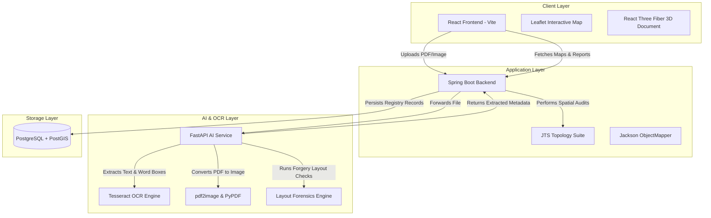

# VeriDeed: Automated Land Deed Forensics & Spatial Validation Platform

VeriDeed is a state-of-the-art web platform designed to automate the verification of property and land sale deeds. By combining Optical Character Recognition (OCR), document layout forensics, and high-precision spatial analysis, the platform detects tampering, identifies overlapping land boundaries, flags conflicting ownership claims, and calculates a unified risk score to prevent property fraud.

---

## 1. Abstract

Property and real estate transactions globally are plagued by fraud, document tampering, and overlapping land claims. Traditional verification processes are manual, slow, and fail to detect sophisticated digital alterations or subtle spatial discrepancies in coordinates.

**VeriDeed** solves these issues by establishing a multi-tier automated pipeline:
1. **Document Forensics**: Analyzes uploaded deeds (PDFs/images) using OCR to verify layout integrity, detect font anomalies (indicative of text overlays), and confirm the presence of official stamp/signature areas.
2. **Metadata & Coordinate Parsing**: Extracts text metadata (owner, survey number, area) and parses boundary coordinates into spatial polygons.
3. **Spatial Overlap & Ownership Auditing**: Performs high-precision spatial intersection queries (using JTS Topology Suite) to compare plot shapes against existing deeds in the database and identifies survey number double-registrations.
4. **Unified Risk Scoring**: Aggregates spatial overlap, document alterations, and ownership alignment into a dynamic risk rating shown on an interactive Leaflet map and a 3D document inspection dashboard.

---

## 2. System Architecture

VeriDeed is designed with a decoupled microservice architecture consisting of a React frontend, a Java Spring Boot orchestrator backend, a FastAPI AI analysis engine, and a PostGIS-enabled PostgreSQL database.



### Component Breakdown

#### 1. React Frontend (Vite)
* **Interactive Map**: Built with `react-leaflet`, rendering land boundaries as interactive polygons. The polygons are color-coded dynamically based on the calculated risk of the deed (Safe = Green, Warning = Amber, Danger = Red).
* **3D Hologram Deed**: Implemented with `@react-three/fiber` and `@react-three/drei` to present a floating 3D representation of the deed, highlighting stamp locations and alignment grids to visually represent layout verification.
* **Vector Boundary Preview**: Custom SVG visualizer mapping latitude and longitude points to a grid.
* **Audit Dashboard**: Displays real-time metrics (average risk, total monitored area, active conflict cases) and a step-by-step breakdown of layout issues.

#### 2. Java Spring Boot Backend
* **Orchestration**: Manages the upload workflow, securely saves documents locally, and routes files to the AI analysis service.
* **Spatial Intersection Analysis**: Utilizes the **JTS Topology Suite** (`org.locationtech.jts`) to perform local geometric calculations on Well-Known Text (WKT) polygons. It checks intersections, calculates exact overlap percentages, and retrieves overlapping deed histories without overloading the DB.
* **Conflict Auditor**: Queries existing records to verify if the survey number has been registered to another user (Ownership Clash).
* **Database Mapping & DTOs**: Employs JPA repositories for persisting `Deed`, `Property`, and `ForensicReport` records.

#### 3. Python FastAPI AI Service
* **OCR Pipeline**: Ingests document bytes. Uses `pypdf` for digital text extraction and falls back to `pdf2image` + `pytesseract` to extract word bounding boxes from scanned documents.
* **Layout Forensics Engine**: Groups words into horizontal lines by rounding layout coordinates. Detects:
  * **Font Anomalies**: Flags words whose heights exceed or fall short of the line's median height by a threshold (detects copy-paste overlays).
  * **Alignment Anomalies**: Flags suspicious horizontal gaps in the middle of sentences.
  * **Registry Verifiers**: Scans text for official seals, sub-registrar stamps, and witness signatures.
* **Metadata Extractor**: Uses regular expressions to extract owner names, survey numbers, plot sizes, and WGS 84 boundary coordinates.

#### 4. PostgreSQL Database
* **PostGIS Extensions**: Enabled for spatial query preparation and geometric storage.
* **Users Table**: Manages authorized registry inspectors.
* **Deeds Table**: Stores metadata, survey numbers, and source document paths.
* **Properties Table**: Stores physical area and boundaries (stored as Well-Known Text).
* **Forensic Reports Table**: Stores individual OCR scores, layout integrity scores, overlap scores, final risk, and a detailed JSONB payload of layout violations.

---

## 3. Data Processing Flow

The workflow below illustrates the lifecycle of a deed from upload to spatial representation:

```
[User Uploads Deed]
        │
        ▼
[Spring Boot Backend] ──(Forward File)──► [FastAPI AI Service]
                                                  │
                                            (Convert to Image)
                                                  │
                                                  ▼
                                            [pytesseract OCR]
                                                  │
                                         (Extract Words & BBoxes)
                                                  │
                                                  ▼
                                         [Layout Forensics]
                                         - Font checks
                                         - Gaps checks
                                         - Stamps checks
                                                  │
                                                  ▼
                                         [Metadata Parser]
                                         - Owner & Survey
                                         - Boundary Points
                                                  │
                                           (JSON Response)
                                                  │
        ◄─────────────────────────────────────────┘
        │
[Spring Boot Backend]
        │
        ├─► [JTS Geometry Auditor]
        │   ├── Computes Polygon overlaps with other deeds
        │   └── Determines Overlap Risk (0 - 100)
        │
        ├─► [Ownership Check]
        │   └── Flags if Survey No. belongs to someone else
        │
        ├─► [Risk Aggregator]
        │   └── finalRisk = 0.4*Layout + 0.4*Overlap + 0.2*Ownership
        │
        ├─► [PostgreSQL Persist]
        │   └── Saves Deed, Property & ForensicReport records
        │
        ▼
[React Frontend]
- Map Polygons updated & colored (Red/Amber/Green)
- 3D holographic document highlights issues
- Complete audit report with suspicious zones
```

---

## 4. Forensic & Spatial Risk Calculation

The system calculates a multi-dimensional risk rating of the deed:

$$\text{Final Risk} = (0.4 \times \text{Layout Risk}) + (0.4 \times \text{Overlap Risk}) + (0.2 \times \text{Ownership Conflict})$$

1. **Layout Risk ($100 - \text{Layout Score}$)**:
   * **Base Score**: $100\%$
   * **Stamp Missing**: $-20\%$
   * **Signature Missing**: $-15\%$
   * **Font height variance**: $-5\%$ per detected word anomaly (text overlay detection).
   * **Layout gaps**: $-5\%$ per alignment gap.
2. **Overlap Risk**:
   * Equals the maximum boundary overlap percentage ($\%$) with any pre-registered property.
3. **Ownership Conflict**:
   * Evaluates to $100\%$ if the survey number matches an existing registered property but the owner's name differs. Otherwise $0\%$.

---

## 5. Technology Stack Summary

| Layer | Technologies & Libraries | Key Responsibilities |
| :--- | :--- | :--- |
| **Frontend** | React, Vite, Leaflet, React Leaflet, React Three Fiber, Three.js, Lucide Icons, Axios | Visualization of parcel boundaries, interactive map routing, 3D holographic inspection, audit reporting. |
| **Backend** | Java 17, Spring Boot 3.x, JTS (Java Topology Suite), Jackson, Spring Data JPA, Lombok | API gateway, transaction management, polygon intersection auditing, ownership database matching. |
| **AI Forensics** | Python 3.10, FastAPI, PyTesseract, Tesseract OCR, pdf2image, PyPDF, NumPy | OCR word bounding-box extraction, layout analysis, font height verification, coordinate regex parsing. |
| **Database** | PostgreSQL, PostGIS | Relational storage, user tables, deed registries, spatial query support. |
